# Adafruit GFX Examples Rendering

A little tool to render examples of all the fonts included in the Adafruit GFX library.

**Compile**:

`$ make`

**Run**:

`$ ./render`

**Update Readme**:

`$ ./update_readme.sh`

## Fonts
### DefaultFont

### FreeMono12pt7b
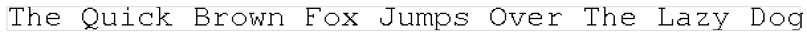

### FreeMono18pt7b
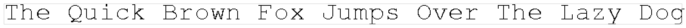

### FreeMono24pt7b
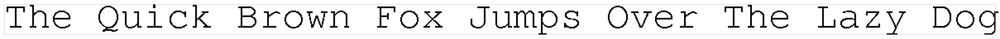

### FreeMono9pt7b

### FreeMonoBold12pt7b

### FreeMonoBold18pt7b

### FreeMonoBold24pt7b

### FreeMonoBold9pt7b

### FreeMonoBoldOblique12pt7b
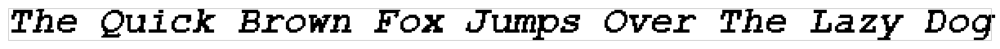

### FreeMonoBoldOblique18pt7b

### FreeMonoBoldOblique24pt7b
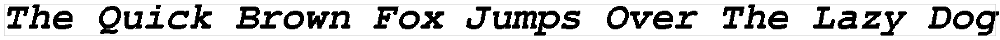

### FreeMonoBoldOblique9pt7b

### FreeMonoOblique12pt7b
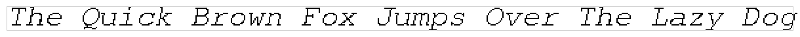

### FreeMonoOblique18pt7b
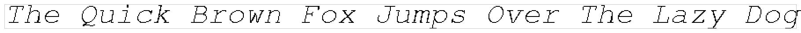

### FreeMonoOblique24pt7b
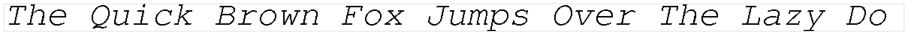

### FreeMonoOblique9pt7b

### FreeSans12pt7b
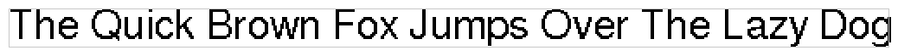

### FreeSans18pt7b
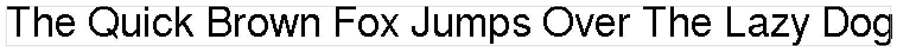

### FreeSans24pt7b
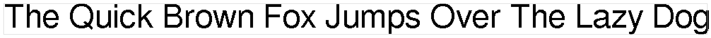

### FreeSans9pt7b

### FreeSansBold12pt7b

### FreeSansBold18pt7b

### FreeSansBold24pt7b

### FreeSansBold9pt7b

### FreeSansBoldOblique12pt7b

### FreeSansBoldOblique18pt7b

### FreeSansBoldOblique24pt7b
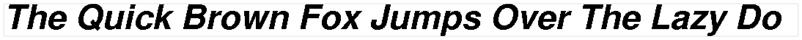

### FreeSansBoldOblique9pt7b

### FreeSansOblique12pt7b
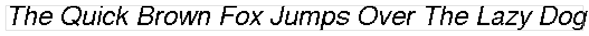

### FreeSansOblique18pt7b
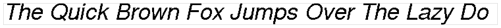

### FreeSansOblique24pt7b
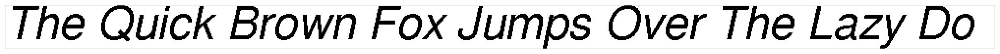

### FreeSansOblique9pt7b
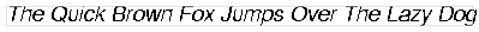

### FreeSerif12pt7b
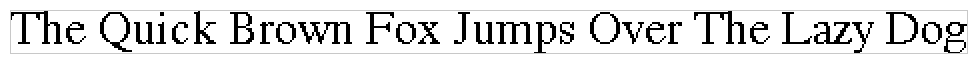

### FreeSerif18pt7b

### FreeSerif24pt7b

### FreeSerif9pt7b

### FreeSerifBold12pt7b

### FreeSerifBold18pt7b

### FreeSerifBold24pt7b

### FreeSerifBold9pt7b

### FreeSerifBoldItalic12pt7b
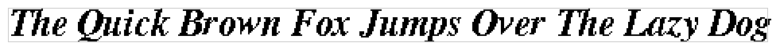

### FreeSerifBoldItalic18pt7b
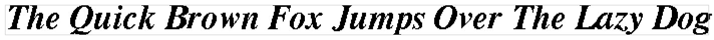

### FreeSerifBoldItalic24pt7b
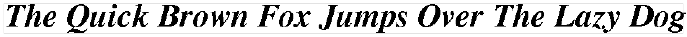

### FreeSerifBoldItalic9pt7b
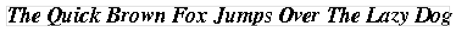

### FreeSerifItalic12pt7b
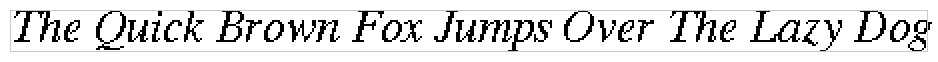

### FreeSerifItalic18pt7b
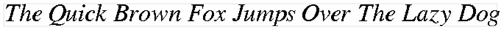

### FreeSerifItalic24pt7b
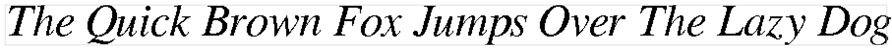

### FreeSerifItalic9pt7b
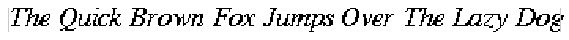

### Org_01

### Picopixel

### Tiny3x3a2pt7b

### TomThumb

